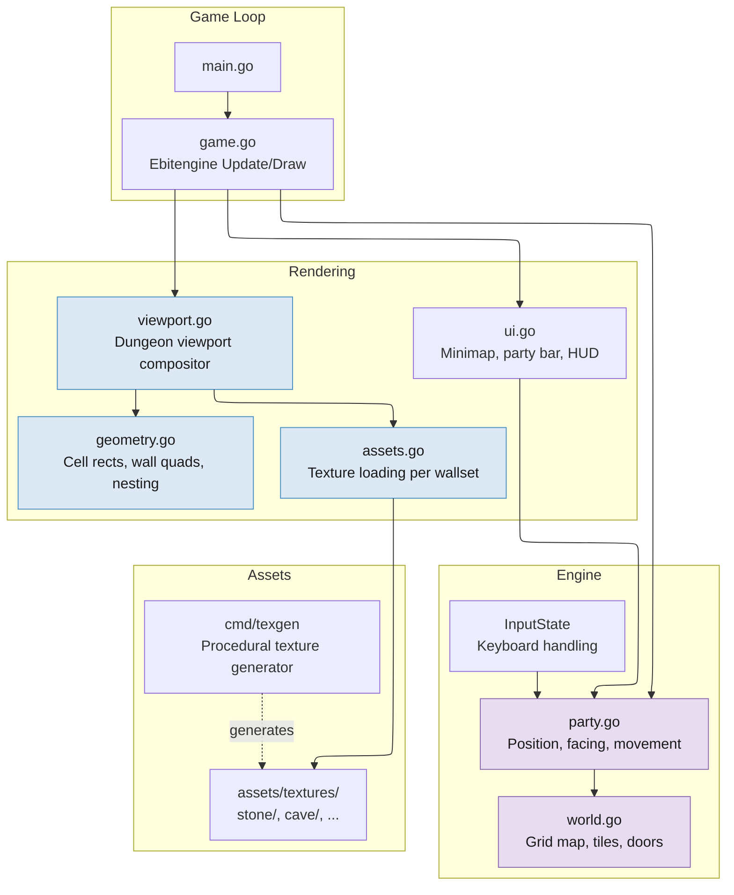

# The Legend of Irondeep

A love letter to Eye of the Beholder II, one of the best dungeon crawlers ever made.

I spent way too many hours playing EoB2 as a kid, mapping corridors on graph paper and panicking when the party got ambushed in the dark. This project is my attempt to rebuild that experience from scratch in Go, using modern tooling but staying true to what made the original special.

## What's Different

The original Westwood team hand-drew every wall texture with perspective already baked in and used palette fade tables for lighting. I'm taking a different approach: flat textures warped at runtime, procedural shading, and temporary AI-generated art. The dungeon viewport uses the same nested-rectangle trick as the original (documented nicely by [Screaming Brain Studios](https://screamingbrainstudios.com/first-person-dungeons/)), but the rendering pipeline is built on top of [Ebitengine](https://ebitengine.org/) rather than raw VGA blitting.

AD&D 2nd Edition rules. Real-time combat with THAC0. Vancian spellcasting. Grid-based movement. All the good stuff.

## Running It

```bash
go run .
```

Arrow keys or WASD to move. Q/E to strafe. ESC to quit.

## Roadmap

What's done and what's ahead, roughly in order:

- [x] Dungeon viewport rendering (walls, floor, ceiling, doors, depth shading)
- [x] Grid-based movement and collision
- [x] Wallset system (swap textures per level)
- [ ] Characters (stats, races, classes, HP, AC, inventory)
- [ ] Character creation flow
- [ ] UI panels (portraits, HP bars, inventory, spell bar)
- [ ] Monsters (data, sprites in viewport, spawning)
- [ ] Combat (THAC0, real-time attack timers, weapon speed, back-row rules)
- [ ] Monster AI (state machine: pursue, attack, flee, pack tactics)
- [ ] Items (weapons, armor, potions, equip slots, pick up/drop)
- [ ] Magic (spell memorization, casting, effects, quick-cast bar)
- [ ] Dungeon features (locked doors, pressure plates, pits, teleporters, secret walls)
- [ ] Level 1 content (map, monster placement, items, puzzles, boss)
- [ ] Save/load, automap, sound, polish

See [docs/PLAN.md](docs/PLAN.md) for the full breakdown.

## Architecture



The viewport rendering pipeline (blue) is where the dungeon drawing happens. See [docs/VIEWPORT.md](docs/VIEWPORT.md) for a deep dive on how the cell-grid geometry and wall rendering work.

## References

- [Screaming Brain Studios: First Person Dungeons](https://screamingbrainstudios.com/first-person-dungeons/) - the cell-grid rendering technique
- [Screaming Brain Studios Dungeon Crawler Asset Pack](https://screamingbrainstudios.itch.io/dungeon-crawler-pack) - reference for the art style
- [Eye of the Beholder II](https://en.wikipedia.org/wiki/Eye_of_the_Beholder_II:_The_Legend_of_Darkmoon) - the game that started all of this
