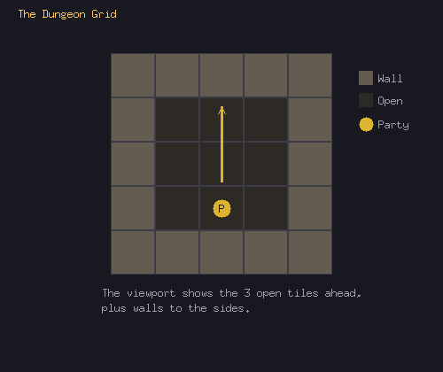
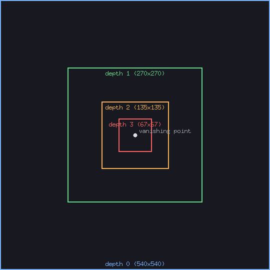
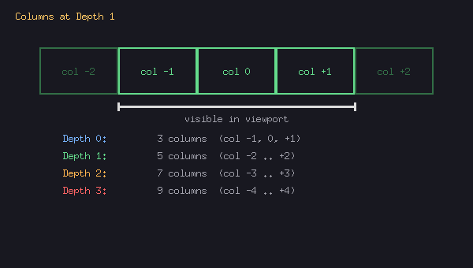
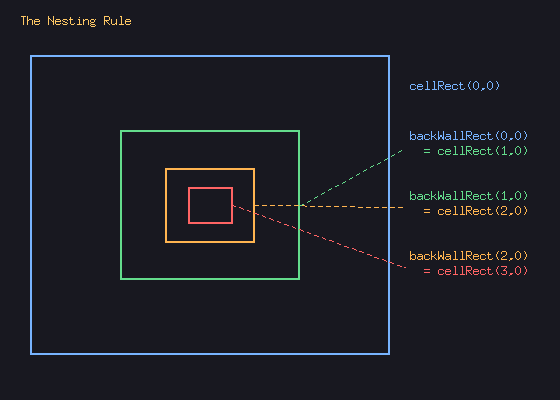
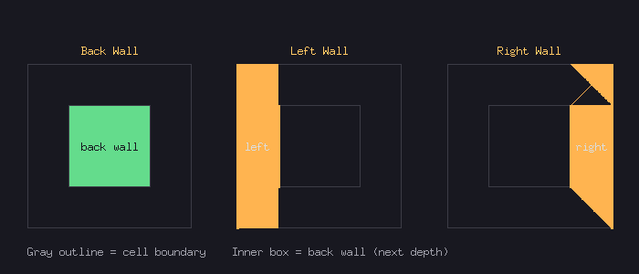
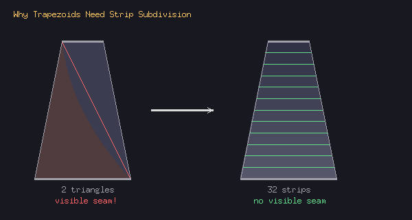
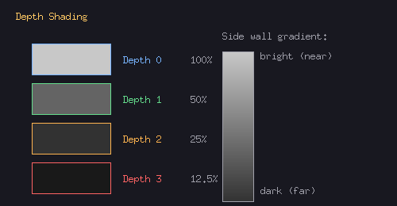
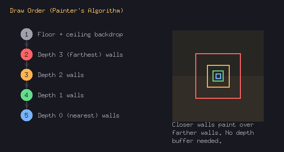

# How the Dungeon Viewport Works

This explains the rendering system in `render/geometry.go` and `render/viewport.go`. No 3D math or linear algebra required — the whole thing is a 2D trick.

## The Big Idea

We don't do 3D rendering. Instead, we fake perspective by drawing a series of nested rectangles that get smaller toward the center of the screen. Closer walls are big, farther walls are small. Your brain reads this as depth.

This is the same technique Eye of the Beholder II used in 1991 and is documented by [Screaming Brain Studios](https://screamingbrainstudios.com/first-person-dungeons/).

## The Grid

The dungeon is a 2D grid. Each tile is either open (you can walk there) or a wall. The viewport shows what the party sees looking forward from their current position.



## Depth Layers

The viewport is 540x540 pixels. We render 4 "depth layers" (0 through 3), where depth 0 is the tile the party stands in and depth 3 is the farthest visible tile.

Each layer is **half the size** of the previous one. All layers are centered on the same point: the middle of the viewport (270, 270). This center point is the **vanishing point** — where parallel lines appear to converge, like looking down a long hallway.



## Cells and Columns

Each depth layer is divided into **columns** (cells side by side). The deeper the layer, the more columns — because you can see more of the dungeon at a distance. Column 0 is always directly ahead. Negative columns are to your left, positive to your right.

Each cell is the same size at a given depth — they tile horizontally. Most off-center cells are partially or fully off-screen. That's fine — the viewport clips them automatically.



## The Nesting Rule

This is the most important property of the whole system:

> **The back wall of cell (depth N, column C) is exactly the same rectangle as cell (depth N+1, column C).**

In code: `backWallRect(depth, col) == cellRect(depth+1, col)`

This is what makes the layers nest seamlessly. When you draw the back wall of a depth-0 cell, you're drawing a rectangle that's exactly where the depth-1 cells sit. No gaps, no overlaps.



## Three Types of Walls

For each open cell, we potentially draw three walls:

- **Back Wall** — a flat rectangle drawn where the next depth layer starts. Uses the nesting rule for positioning.
- **Left Wall** — a trapezoid connecting the left edge of the cell to the left edge of the back wall. The outer edge (near the player) is tall; the inner edge (far) is short, creating the illusion of a wall receding into the distance.
- **Right Wall** — same as left wall, mirrored.



## How We Differ From the Original

In EoB2 (and the SBS technique), side wall textures had **perspective baked into the artwork**. Artists pre-skewed the texture in an image editor (e.g., GIMP's Perspective Tool), and the game drew them as flat rectangles. Each depth layer needed its own pre-distorted version of the wall texture.

We do it differently: our wall textures are **flat, undistorted PNGs**, and we warp them at runtime by drawing them onto trapezoid-shaped quads. This means:

- One texture works at every depth (no need for pre-skewed variants)
- Adding a new wallset is just 5 flat PNGs, no perspective editing needed
- The tradeoff is we need the strip subdivision trick (below) to avoid GPU artifacts

## Why Trapezoids Need Special Handling

GPUs draw textured shapes using triangles. To draw a trapezoid, you split it into two triangles. The problem: GPUs use **affine** texture mapping per triangle, which stretches the texture linearly. This works fine for rectangles, but for trapezoids the two triangles have different stretch ratios, creating a visible seam down the diagonal.

Our `drawQuad` detects non-rectangular shapes and subdivides them into 32 horizontal strips. Each strip is close enough to a rectangle that the affine distortion is invisible.



## Shading

Deeper walls are darker to simulate light falloff from the party's torches. Brightness halves at each depth layer.

Side walls get a **gradient**: bright on the outer (near) edge, dark on the inner (far) edge. This is done per-vertex — the GPU interpolates the brightness smoothly across the wall.

Back walls use the brightness of their actual depth position: `cellShade(depth + 1)`, not the current cell's shade. This matters because the back wall sits at the boundary of the next depth layer.



## Draw Order

We draw back-to-front (painter's algorithm). Closer walls paint over farther walls. No depth buffer needed.



## From World Coordinates to Screen

`drawCell` translates between the dungeon grid and the viewport. Given the party's position, facing direction, and a (depth, col) pair, it figures out which world tile that corresponds to:

```go
cx := party.X + dx*depth + ldx*(-col)
cy := party.Y + dy*depth + ldy*(-col)
```

- `dx, dy` = one step in the facing direction (e.g., north = 0,-1)
- `ldx, ldy` = one step to the left of facing direction
- `depth` = how many tiles ahead
- `col` = how many tiles to the side (negative = left of the left direction, hence `-col`)

Then it checks the world grid: is there a wall to the left? Draw a left wall quad. Wall to the right? Draw a right wall quad. Wall ahead? Draw a back wall.

## Files

- **`geometry.go`** — pure math. `cellRect`, `backWallRect`, `leftWallQuad`, `rightWallQuad`, `columnRange`. No rendering, no game state. Fully tested in `geometry_test.go`.
- **`viewport.go`** — rendering. Draws the backdrop, iterates depth layers, calls into geometry for positions, draws textured quads with shading.
- **`placeholder.go`** — loads wall/floor/ceiling/door textures from PNG files in `assets/textures/`.
